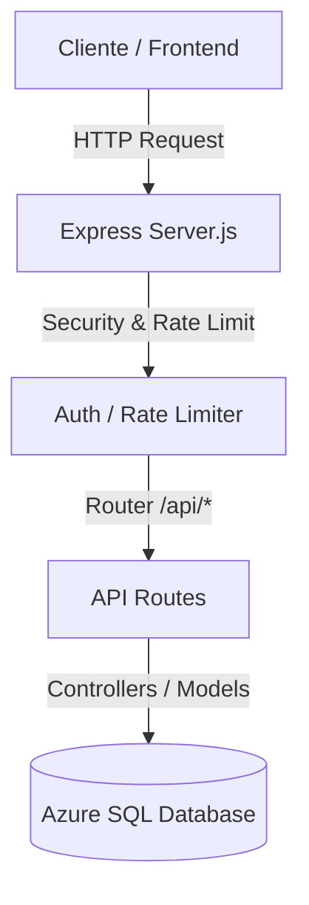

# Análisis del Sistema Backend: PYMES Chiquimula

Este documento proporciona un análisis exhaustivo del estado actual del **Backend** de la aplicación PYMES Chiquimula, detallando los endpoints disponibles, la estructura de la base de datos en Azure SQL, y qué funcionalidades están operativas.

---

## 🚀 Estado del Servidor
El servidor del backend está desarrollado en **Node.js** con **Express** y se encuentra actualmente activo y en ejecución en el puerto `3000`.

- **Endpoint de Salud (Health Check)**: Operativo en [http://localhost:3000/health](http://localhost:3000/health)
- **Conectividad a la Base de Datos**: Operativa y exitosa en [http://localhost:3000/api/test-db](http://localhost:3000/api/test-db) (Conectando a Azure SQL Database `BD-PYMES-Chiquimula` en `pymes-chiquimula-server.database.windows.net`).

---

## 📊 Estructura y Registros de la Base de Datos (Azure SQL)
La base de datos contiene **15 tablas**. A continuación se detalla su cantidad de registros actual y propósito:

| Nombre de Tabla | Registros | Descripción y Propósito |
| :--- | :---: | :--- |
| **`Usuarios`** | `8` | Usuarios registrados en el sistema (credenciales, tokens, roles y estados). |
| **`Roles`** | `4` | Definición de roles de acceso (`admin`, `usuario`, etc.). |
| **`Categorias`** | `13` | Categorías de negocios en Chiquimula (Gastronomía, Comercio, Artesanías, etc.). |
| **`Emprendimientos`** | `37` | Información principal de cada PYME/Emprendimiento registrada. |
| **`ProductosServicios`** | `87` | Catálogo de productos o servicios ofrecidos por cada emprendimiento. |
| **`RedesSociales`** | `15` | Enlaces a redes sociales de los emprendimientos. |
| **`ImagenesEmprendimiento`** | `21` | Galería de imágenes (banners/logos) de los emprendimientos. |
| **`ImagenesProducto`** | `0` | Galería de imágenes de los productos específicos (sin registros actualmente). |
| **`Publicaciones`** | `26` | Solicitudes y logs de aprobación de listados por el Administrador. |
| **`HistorialCambios`** | `7` | Bitácora de cambios/auditoría registrados de la información de los negocios. |
| **`EstadisticasDiarias`** | `22` | Registro diario de vistas, clics a WhatsApp, clics a Google Maps y búsquedas. |
| **`Calificaciones`** | `16` | Puntuaciones de 1 a 5 estrellas dadas a los emprendimientos. |
| **`Valoraciones`** | `16` | Comentarios escritos/reseñas dejadas por usuarios. |
| **`SugerenciasIA`** | `0` | Sugerencias de contenido generadas por IA para optimización (sin registros). |
| **`LogBusquedas`** | `15` | Historial de palabras clave buscadas por los usuarios. |

---

## 🛠️ Arquitectura de Rutas y Endpoints
El backend está estructurado con middleware de seguridad (`helmet`, `cors`, `rate-limiter-flexible`) y autenticación basada en JSON Web Tokens (JWT).

A continuación se enlistan los endpoints mapeados por cada ruta/módulo en `/api`:

### 1. Autenticación (`/api/auth`)
Permite registrar usuarios, iniciar sesión y administrar el perfil del usuario activo.
- `POST /register` 🟢 **Público** - Registro de usuarios nuevos.
- `POST /login` 🟢 **Público** - Inicio de sesión.
- `POST /google` 🟢 **Público** - Autenticación integrada de Google.
- `GET /profile` 🔒 **Autenticado** - Obtiene los datos del perfil actual.
- `PUT /profile` 🔒 **Autenticado** - Actualiza datos básicos del perfil.
- `PUT /change-password` 🔒 **Autenticado** - Actualiza contraseña.

### 2. Gestión de Usuarios (`/api/users`)
Control administrativo de usuarios registrados.
- `GET /` 🛡️ **Solo Admin** - Lista de usuarios con paginación.
- `GET /:id` 🛡️ **Solo Admin** - Obtener detalles de un usuario específico.
- `PUT /:id/status` 🛡️ **Solo Admin** - Activar o desactivar cuenta de usuario.

### 3. Roles de Usuario (`/api/roles`)
Configuración de permisos en el sistema.
- `GET /` 🟢 **Público** - Listar todos los roles.
- `GET /:id` 🟢 **Público** - Obtener rol específico por ID.
- `POST /` 🛡️ **Solo Admin** - Crear un rol nuevo.
- `PUT /:id` 🛡️ **Solo Admin** - Modificar rol existente.

### 4. Categorías (`/api/categories`)
Clasificación de los emprendimientos.
- `GET /` 🟢 **Público** - Obtener categorías (filtrable por `?active=true`).
- `GET /tree` 🟢 **Público** - Obtener árbol jerárquico de categorías y subcategorías.
- `GET /:id` 🟢 **Público** - Obtener detalles de una categoría.
- `GET /:id/subcategories` 🟢 **Público** - Obtener subcategorías hijas de un ID.
- `POST /` 🛡️ **Solo Admin** - Crear nueva categoría.
- `PUT /:id` 🛡️ **Solo Admin** - Modificar categoría existente.

### 5. Emprendimientos/Negocios (`/api/emprendimientos`)
El núcleo del directorio de PYMES.
- `GET /` 🟢 **Público** - Listado de emprendimientos con paginación, filtros e información agregada de promedio de calificación y cantidad de productos.
- `GET /search` 🟢 **Público** - Búsqueda semántica/texto de emprendimientos (con limitador de tasa de búsquedas).
- `GET /:id` 🟢 **Público** - Obtener perfil detallado de un emprendimiento específico.
- `GET /my/emprendimientos` 🔒 **Autenticado** - Obtener negocios pertenecientes al usuario firmado.
- `POST /` 🔒 **Autenticado** - Crear/registrar solicitud de nuevo emprendimiento.
- `PUT /:id` 🔒 **Autenticado** - Modificar datos de emprendimiento propio.

### 6. Productos y Servicios (`/api/productos`)
Catálogo comercial de cada negocio.
- `GET /` 🟢 **Público** - Listar todos los productos filtrados por precio, disponibilidad o tipo.
- `GET /search` 🟢 **Público** - Búsqueda de productos específicos por término `?q=`.
- `GET /emprendimiento/:id_emprendimiento` 🟢 **Público** - Catálogo completo de un negocio específico.
- `GET /:id` 🟢 **Público** - Detalles de un producto individual.
- `POST /` 🔒 **Autenticado** - Agregar producto a emprendimiento (requiere ser el dueño).
- `PUT /:id` 🔒 **Autenticado** - Modificar datos de un producto.

### 7. Imágenes (`/api/imagenes`)
Multimedia del directorio.
- `GET /emprendimiento/:id_emprendimiento` 🟢 **Público** - Galería de imágenes de un negocio.
- `GET /producto/:id_producto` 🟢 **Público** - Galería de imágenes de un producto específico.
- `POST /emprendimiento` 🔒 **Autenticado** - Añadir imagen a galería del negocio.
- `POST /producto` 🔒 **Autenticado** - Añadir imagen a la galería del producto.

### 8. Publicaciones y Moderación (`/api/publicaciones`)
Control de aprobación e historial de listados de PYMES.
- `GET /` 🔒 **Autenticado** - Listar solicitudes de publicación (Admin ve todas, usuarios ven las suyas).
- `GET /:id` 🔒 **Autenticado** - Detalles de una solicitud de publicación específica.
- `POST /` 🔒 **Autenticado** - Crear una nueva solicitud de publicación/cambio.
- `PUT /:id/resolve` 🛡️ **Solo Admin** - Aprobar o rechazar solicitud de publicación.

### 9. Estadísticas (`/api/estadisticas`)
Métricas de interacción con los negocios.
- `GET /emprendimiento/:id_emprendimiento` 🟢 **Público** - Métricas diarias de un negocio por rango de fechas.
- `GET /emprendimiento/:id_emprendimiento/summary` 🟢 **Público** - Total acumulado de visitas, clics a WhatsApp y clics a Maps.
- `POST /daily` 🔒 **Autenticado** - Insertar o actualizar estadísticas diarias.
- `GET /dashboard` 🛡️ **Solo Admin** - Estadísticas agregadas globales y Top 10 de PYMES más visitadas.

### 10. Valoraciones y Comentarios (`/api/valoraciones`)
Módulo de reputación de negocios.
- `GET /` 🟢 **Público** - Lista de valoraciones.
- `GET /emprendimiento/:id_emprendimiento` 🟢 **Público** - Reseñas de un negocio específico.
- `GET /:id` 🟢 **Público** - Obtener reseña por ID.
- `POST /` 🔒 **Autenticado** - Enviar nueva reseña (comienza en estado pendiente de aprobación).
- `PUT /:id` 🔒 **Autenticado** - Editar reseña propia.
- `PUT /:id/approve` 🛡️ **Solo Admin** - Aprobar reseña pendiente para ser visible al público.

### 11. Sugerencias IA (`/api/sugerencias`)
Optimización inteligente de contenido.
- `GET /` 🔒 **Autenticado** - Listar sugerencias de optimización generadas.
- `GET /emprendimiento/:id_emprendimiento` 🔒 **Autenticado** - Sugerencias específicas para un negocio.
- `POST /` 🔒 **Autenticado** - Guardar una nueva sugerencia IA.
- `PUT /:id/accept` 🔒 **Autenticado** - Aceptar la sugerencia para ser aplicada.
- `PUT /:id/reject` 🔒 **Autenticado** - Rechazar la sugerencia.
- `DELETE /:id` 🔒 **Autenticado** - Borrar sugerencia.

---

## 📌 ¿Qué cosas están funcionando correctamente?
Tras auditar el sistema mediante peticiones y scripts directos, confirmamos el correcto funcionamiento de los siguientes módulos esenciales:

1. **Servidor y API (Express)**: Levanta sin fallos y responde adecuadamente a las rutas definidas.
2. **Conexión SQL Server (Azure SQL)**: Las consultas se ejecutan de manera limpia a través de la librería `mssql`.
3. **Lectura de Directorio (`GET /api/emprendimientos` y `/api/categories`)**:
   - Responde exitosamente retornando los registros directamente desde la base de datos.
   - Retorna la paginación correcta e información relacionada (como la categoría y el usuario propietario).
4. **Esquema de Base de Datos**:
   - Las tablas están inicializadas y cuentan con datos de prueba realistas para desarrollo (p. ej., 37 emprendimientos registrados y 87 productos listados).
